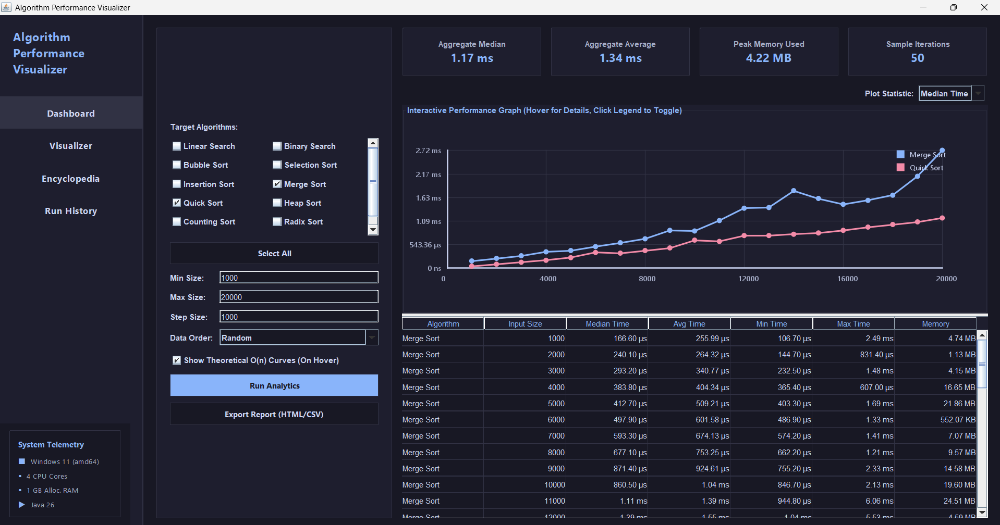
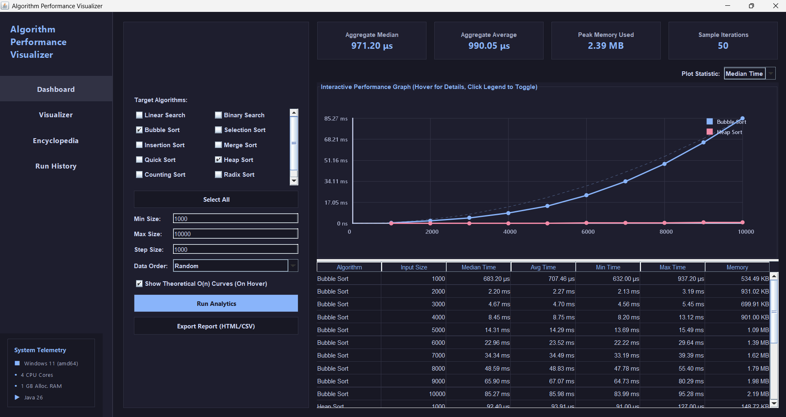
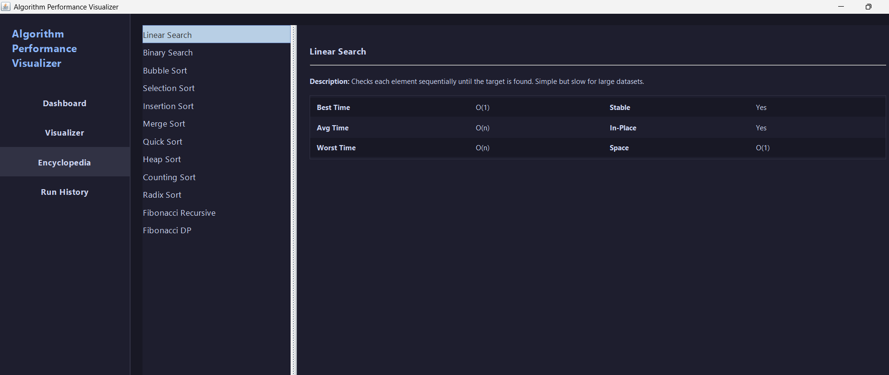

# 📊 Algorithm Performance Visualizer

A Java Swing application for benchmarking and visualizing the performance of common searching, sorting, and recursion algorithms. It allows users to compare execution time across different input sizes and explore the theoretical time and space complexity of each algorithm.

---

## ✨ Features

- 📈 Interactive performance graphs
- ⚡ Compare multiple algorithms simultaneously
- 🧮 Displays:
  - Best, Average & Worst execution time
  - Median execution time
  - Peak memory usage
- 📚 Built-in algorithm encyclopedia with complexity information
- ⚙️ Customizable input:
  - Minimum & Maximum input size
  - Step size
  - Data order (Random, Ascending, Descending, Nearly Sorted)
- 📄 Export benchmark reports (HTML/CSV)
- 🕒 Run history to review previous benchmark sessions
- 🌙 Modern dark-themed Java Swing interface

---

## 🔍 Supported Algorithms

### Searching
- Linear Search
- Binary Search

### Sorting
- Bubble Sort
- Selection Sort
- Insertion Sort
- Merge Sort
- Quick Sort
- Heap Sort
- Counting Sort
- Radix Sort

### Recursion
- Fibonacci (Recursive)
- Fibonacci (Dynamic Programming)

---

## 📖 Complexity Information

For every algorithm, the application provides:

- ✅ Best Case Time Complexity
- ✅ Average Case Time Complexity
- ✅ Worst Case Time Complexity
- ✅ Space Complexity
- ✅ Brief algorithm description

---

## 🛠️ Technologies Used

- ☕ Java
- 🖥️ Java Swing
- 📊 JFreeChart
- 📦 Java Collections Framework

---

## 📸 Screenshots

### Dashboard


### Performance Comparison


### Algorithm Encyclopedia


---

## 🚀 Getting Started

### Prerequisites

- Java JDK 17 or later
- An IDE such as IntelliJ IDEA, Eclipse, or VS Code

### Run the Project

1. Clone the repository
   ```bash
   git clone https://github.com/theharshitrana/Time-Complexity.git
   ```

2. Open the project in your preferred Java IDE.

3. Run `AlgorithmPerformanceVisualizer.java`.

---

## 📂 Project Structure

```
Time-Complexity/
│── AlgorithmPerformanceVisualizer.java
│── README.md
└── images/
```

---

## 🔮 Future Improvements

- 🎬 Algorithm animations
- 🤖 AI-based algorithm explanations
- 📊 More comparison metrics
- 🎨 Additional UI themes
- ➕ Support for more algorithms

---

## 👨‍💻 Author

**Harshit**
